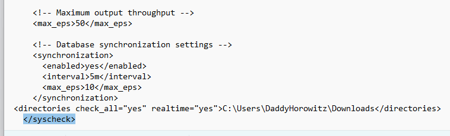
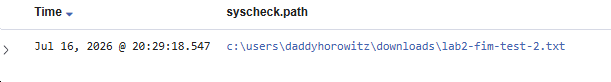
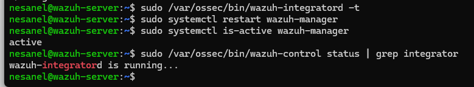
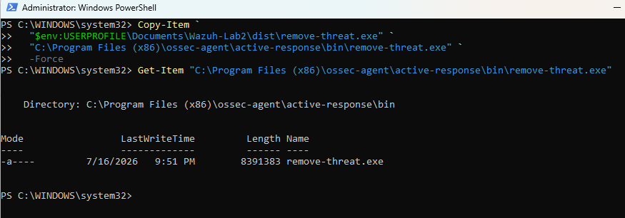
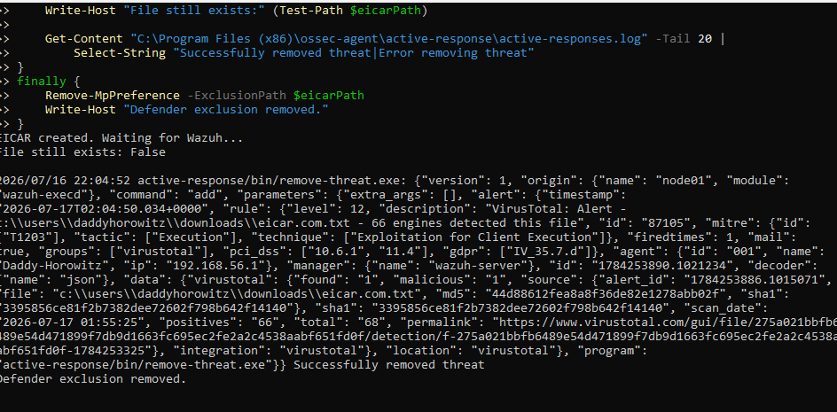
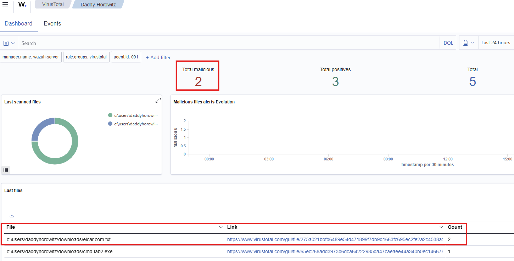
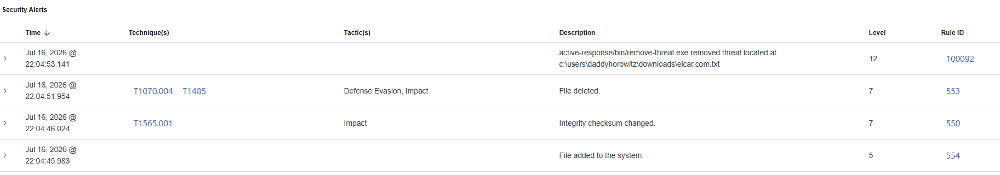

> **Project Goal**
>
> Build an automated endpoint malware-response pipeline that detects newly downloaded files, checks their hashes against VirusTotal, and removes files identified as malicious.

# Lab 02 - Automated Malware Detection and Response with Wazuh & VirusTotal

**Status:** Complete

---

## Overview

This lab extends the Wazuh Home SOC created in Lab 01 by adding automated malware detection and response capabilities.

Wazuh File Integrity Monitoring (FIM) monitors the Windows Downloads directory for newly created or modified files. When a file change is detected, Wazuh calculates the file hash and queries the VirusTotal API for threat intelligence. If VirusTotal identifies the file as malicious, Wazuh triggers an Active Response script on the Windows endpoint to remove it automatically.

The pipeline was tested safely using the EICAR antivirus test file.

---

## Objectives

- [x] Monitor the Windows Downloads directory using real-time FIM
- [x] Integrate Wazuh with the VirusTotal API
- [x] Validate hash lookups using a legitimate Windows executable
- [x] Create a Windows Active Response script
- [x] Package the Python response script as an executable
- [x] Trigger automated removal when VirusTotal detects a malicious file
- [x] Validate the workflow using the EICAR test file
- [x] Confirm successful removal through Wazuh alerts and endpoint logs

---

## Technologies

- Wazuh 4.8.2
- Windows 11
- Ubuntu Server
- VirusTotal API
- Wazuh File Integrity Monitoring
- Wazuh Active Response
- Python 3
- PyInstaller
- PowerShell
- EICAR antivirus test file

---

## Detection and Response Workflow

1. A file is created in the Windows Downloads directory.
2. Wazuh FIM detects the file change.
3. Wazuh calculates the file hash.
4. The Wazuh Integrator submits the hash to VirusTotal.
5. VirusTotal returns its detection results.
6. A malicious result triggers Wazuh Rule `87105`.
7. Wazuh executes `remove-threat.exe` on the Windows endpoint.
8. The file is deleted and custom Rule `100092` confirms successful removal.

```text
Windows Downloads Directory
            |
            v
   Wazuh File Integrity Monitoring
            |
            v
       File Hash Generated
            |
            v
      VirusTotal API Lookup
            |
       +----+----+
       |         |
     Clean    Malicious
       |         |
    Alert     Rule 87105
                 |
                 v
        Wazuh Active Response
                 |
                 v
       remove-threat.exe
                 |
                 v
        Malicious File Deleted
````
        
## File Integrity Monitoring Configuration

The Windows Wazuh agent was configured to monitor the Downloads directory in real time. Hash collection was enabled so newly created or modified files could be checked against VirusTotal.


     <directories check_all="yes" realtime="yes">
          C:\Users\<USERNAME>\Downloads
     </directories>



*Figure 1. Wazuh File Integrity Monitoring configured to monitor the Windows Downloads directory in real time.*

### FIM Validation

A harmless text file was created in the monitored Downloads directory to validate real-time detection:

    Set-Content "$env:USERPROFILE\Downloads\lab2-fim-test-2.txt" `
      "Wazuh realtime FIM validation"

Wazuh detected the new file and generated a File Integrity Monitoring event.


*Figure 2. Wazuh detecting a newly created file in the monitored Windows Downloads directory.*

---

## VirusTotal Integration

The Wazuh Manager was configured to submit hashes generated by FIM to the VirusTotal API. The API key below is intentionally replaced with a placeholder.

    <integration>
      <name>virustotal</name>
      <api_key>YOUR_VIRUSTOTAL_API_KEY</api_key>
      <group>syscheck</group>
      <alert_format>json</alert_format>
    </integration>

The configuration was validated, the manager was restarted, and the VirusTotal integrator was confirmed as running:

    sudo /var/ossec/bin/wazuh-integratord -t
    sudo systemctl restart wazuh-manager
    sudo systemctl is-active wazuh-manager
    sudo /var/ossec/bin/wazuh-control status | grep integrator




*Figure 3. Wazuh VirusTotal integration validated and the integrator confirmed as running.*

---

## Active Response Script

A Python Active Response script was prepared to receive the VirusTotal alert from Wazuh, extract the affected file path, and remove the malicious file from the Windows endpoint.

The script was packaged as a standalone Windows executable using PyInstaller:

    py -m PyInstaller --onefile --name remove-threat remove-threat.py

The resulting `remove-threat.exe` file was copied to the Wazuh agent’s Active Response directory:

    C:\Program Files (x86)\ossec-agent\active-response\bin\remove-threat.exe



*Figure 4. The packaged Active Response executable deployed to the Windows Wazuh agent.*

The executable itself is excluded from this repository. The reviewed Python source code is provided in the `Scripts` directory.

---

## Active Response Configuration

The Wazuh Manager was configured to execute `remove-threat.exe` on the Windows endpoint when VirusTotal Rule `87105` identified a malicious file.

    <command>
      <name>remove-threat</name>
      <executable>remove-threat.exe</executable>
      <timeout_allowed>no</timeout_allowed>
    </command>

    <active-response>
      <disabled>no</disabled>
      <command>remove-threat</command>
      <location>local</location>
      <rules_id>87105</rules_id>
    </active-response>

Rule `87105` represents a positive VirusTotal malware detection. The `local` setting directs the response to the endpoint that generated the alert.

---

## EICAR Test and Automated Removal

The complete workflow was tested using the harmless EICAR antivirus test file. A temporary Microsoft Defender exclusion was applied only to the exact test-file path so Wazuh could process the file before Defender removed it.

Once the file appeared in the monitored Downloads directory:

1. Wazuh FIM detected the new file.
2. The file hash was submitted to VirusTotal.
3. VirusTotal reported the file as malicious.
4. Rule `87105` triggered the Active Response.
5. `remove-threat.exe` deleted the file.
6. The temporary Defender exclusion was removed.

The endpoint confirmed that the EICAR file no longer existed:

    File still exists: False



*Figure 5. Endpoint log showing the VirusTotal detection, Active Response execution, and automated removal of the EICAR test file.*

---

## VirusTotal Detection Results

VirusTotal identified the EICAR file as malicious, with `66` security engines reporting a detection. Wazuh displayed the malicious result and provided a direct link to the corresponding VirusTotal report.



*Figure 6. Wazuh VirusTotal dashboard showing the EICAR file classified as malicious.*

The EICAR file is a harmless industry-standard antivirus test file. No live malware was used during this lab.

---

## Response Timeline

The Wazuh Security Alerts view confirmed the complete detection-and-response sequence:

| Rule ID | Level | Event |
|---|---:|---|
| `554` | 5 | File added to the monitored directory |
| `550` | 7 | File integrity checksum changed |
| `553` | 7 | File deleted |
| `100092` | 12 | Active Response confirmed successful threat removal |



*Figure 7. Wazuh alert timeline showing file creation, integrity changes, deletion, and successful Active Response confirmation.*

This sequence demonstrates that the pipeline progressed from detection through automated remediation without requiring manual file removal.

---

## Results

The lab successfully demonstrated an automated malware-response pipeline:

- Real-time FIM detected files created in the Windows Downloads directory.
- Wazuh submitted file hashes to VirusTotal.
- Known malicious results triggered Rule `87105`.
- Wazuh executed the custom Active Response on the affected endpoint.
- The EICAR test file was removed automatically.
- Custom Rule `100092` confirmed successful remediation.
- Endpoint logs and Wazuh alerts provided evidence of the complete workflow.

No live malware was used. Testing was performed with harmless files and the industry-standard EICAR test file.

---

## Troubleshooting

### Agent Connection Failure

The Windows agent temporarily lost its connection to the Wazuh Manager on TCP port `1514`. Connectivity was verified with:

    Test-NetConnection 192.168.56.101 -Port 1514

After the manager and agent services were restarted, the agent successfully reconnected.

### Duplicate Agent Name

An enrollment attempt returned a duplicate-agent-name error because the Windows endpoint was already registered. The existing agent registration was retained rather than creating another entry.

### Manager Restart Delay

The Wazuh Manager restart initially appeared to hang while its components reloaded. Service status was verified before continuing:

    sudo systemctl is-active wazuh-manager
    sudo /var/ossec/bin/wazuh-control status

### Windows Defender Interference

Microsoft Defender could remove the EICAR file before Wazuh completed the workflow. Testing used a temporary exclusion limited to the exact EICAR file path. The exclusion was removed immediately after the test.

---

## Lessons Learned

- Real-time FIM can provide the initial detection point for newly downloaded files.
- Hash-based threat intelligence adds useful context but depends on the file already being known to VirusTotal.
- Active Response requires coordination between manager-side rules and endpoint-side executables.
- Service status, agent connectivity, and endpoint logs should be validated separately when troubleshooting.
- Security-tool interference must be controlled carefully during testing and restored immediately afterward.
- Custom confirmation alerts provide clearer evidence that automated remediation succeeded.

---

## Skills Demonstrated

- Wazuh File Integrity Monitoring configuration
- VirusTotal API integration
- Security alert analysis and rule mapping
- Python-based endpoint automation
- PyInstaller executable packaging
- Wazuh Active Response configuration
- Custom Wazuh rule implementation
- Windows and Linux troubleshooting
- PowerShell testing and validation
- Automated incident detection and remediation
  
---

## Repository Structure

    Lab-02-Automated-Malware-Response/
    ├── README.md
    ├── Configs/
    │   ├── active-response.xml
    │   ├── local-rules.xml
    │   ├── virustotal-integration.xml
    │   └── windows-fim.xml
    ├── Figures/
    │   ├── 01-fim-configuration.png
    │   ├── 02-fim-detection.png
    │   ├── 03-virustotal-integrator-running.png
    │   ├── 04-active-response-deployed.png
    │   ├── 05-eicar-removal-log.png
    │   ├── 06-virustotal-dashboard.png
    │   └── 07-response-timeline.png
    └── Scripts/
        └── remove-threat.py

The compiled `remove-threat.exe` file and all API credentials are intentionally excluded from the repository.

---

## References

- [Wazuh File Integrity Monitoring documentation](https://documentation.wazuh.com/current/user-manual/capabilities/file-integrity/index.html)
- [Wazuh VirusTotal integration documentation](https://documentation.wazuh.com/current/user-manual/capabilities/malware-detection/virus-total-integration.html)
- [Wazuh Active Response documentation](https://documentation.wazuh.com/current/user-manual/capabilities/active-response/index.html)
- [VirusTotal documentation](https://docs.virustotal.com/)
- [EICAR antivirus test file](https://www.eicar.org/download-anti-malware-testfile/)
- [PyInstaller documentation](https://pyinstaller.org/)

---

## Disclaimer

This lab was performed in an isolated home environment using the harmless EICAR antivirus test file. No live malware was downloaded or executed.