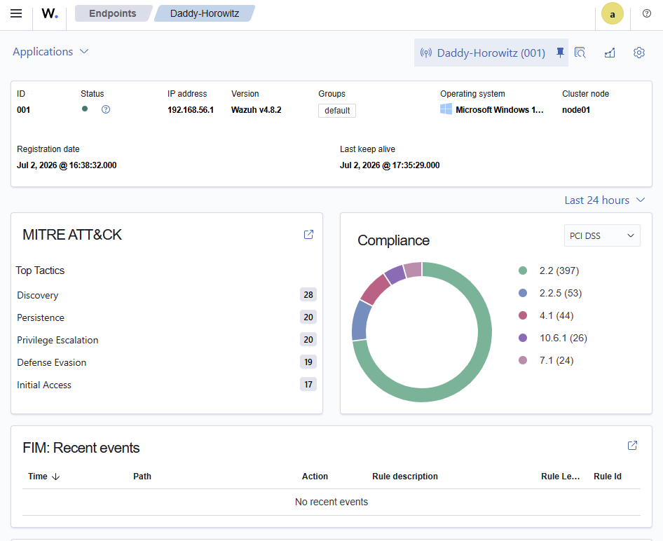
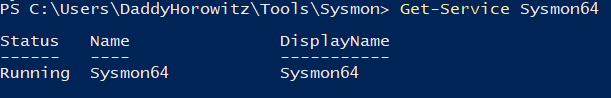

> **Project Goal**
>
> Build a production-style home SOC capable of collecting endpoint telemetry, validating detections, and serving as the foundation for future threat hunting and incident response labs.

# Lab 01 – Building a Home Security Operations Center with Wazuh & Sysmon

**Status:** ✅ Complete

---

## Overview

This lab documents the deployment of a Home Security Operations Center (SOC) using Wazuh and Sysmon. The objective was to build an environment capable of collecting endpoint telemetry, detecting attacker behavior, and performing threat hunting against Windows events.

---

**Technologies**

- Wazuh 4.8.2
- Ubuntu Server 26.04
- Windows 11
- Sysmon
- Oracle VirtualBox
- OpenSSH
- MITRE ATT&CK

--- 

## Table of Contents

- [Lab 01 – Building a Home Security Operations Center with Wazuh \& Sysmon](#lab-01--building-a-home-security-operations-center-with-wazuh--sysmon)
  - [Overview](#overview)
  - [Table of Contents](#table-of-contents)
  - [Objectives](#objectives)
  - [Environment](#environment)
    - [Lab Topology](#lab-topology)
  - [Installation](#installation)
    - [Phase 1 – Ubuntu Server](#phase-1--ubuntu-server)
    - [Phase 2 – Wazuh Deployment](#phase-2--wazuh-deployment)
    - [Phase 3 – Windows Endpoint](#phase-3--windows-endpoint)
    - [Phase 4 – Sysmon Deployment](#phase-4--sysmon-deployment)
  - [Configuration](#configuration)
    - [Wazuh Agent Configuration](#wazuh-agent-configuration)
    - [Validation](#validation)
  - [Validation](#validation-1)
    - [Infrastructure Validation](#infrastructure-validation)
    - [Endpoint Validation](#endpoint-validation)
  - [Detection Engineering](#detection-engineering)
    - [Detection Workflow](#detection-workflow)
    - [Test Commands](#test-commands)
    - [Detection Results](#detection-results)
  - [Threat Hunting](#threat-hunting)
    - [Hunt Objective](#hunt-objective)
    - [Hunt Results](#hunt-results)
  - [Troubleshooting](#troubleshooting)
    - [Issue 1 – Sysmon Events Not Appearing in Wazuh](#issue-1--sysmon-events-not-appearing-in-wazuh)
    - [Issue 2 – Expected Commands Did Not Generate Alerts](#issue-2--expected-commands-did-not-generate-alerts)
    - [Issue 3 – Wazuh Storage Exhaustion](#issue-3--wazuh-storage-exhaustion)
  - [Lessons Learned](#lessons-learned)
    - [Key Takeaways](#key-takeaways)
    - [Skills Demonstrated](#skills-demonstrated)
  - [Next Steps](#next-steps)
--- 

## Objectives

- [x] Build a Wazuh server on Ubuntu Server
- [x] Connect a Windows 11 endpoint
- [x] Deploy Sysmon using the SwiftOnSecurity configuration
- [x] Configure Wazuh to ingest Sysmon events
- [x] Validate end-to-end telemetry
- [x] Generate MITRE ATT&CK detections
- [x] Recover the environment using VirtualBox snapshots

---

## Environment

| Component | Technology |
|----------|------------|
| Hypervisor | Oracle VirtualBox |
| Server | Ubuntu Server 26.04 |
| SIEM | Wazuh v4.8.2 |
| Endpoint | Windows 11 |
| Telemetry | Sysmon |
| Remote Access | OpenSSH |
| Framework | MITRE ATT&CK |

### Lab Topology

This lab simulates a small Security Operations Center (SOC) consisting of a Windows 11 endpoint monitored by Sysmon and a Wazuh server hosted on Ubuntu Server. Endpoint telemetry is forwarded to the Wazuh Manager, where events are analyzed, correlated, and mapped to the MITRE ATT&CK framework.

```text
                      Windows 11 Endpoint
                 +----------------------------+
                 | Sysmon + Wazuh Agent       |
                 +-------------+--------------+
                               |
                        Event Telemetry
                               |
                               v
                 +----------------------------+
                 | Ubuntu Server 26.04        |
                 | Wazuh Manager              |
                 | Wazuh Indexer              |
                 | Wazuh Dashboard            |
                 +-------------+--------------+
                               |
                               v
            Detection • Alerting • Threat Hunting

```



*Figure 1. Wazuh Dashboard after successful deployment of the Home SOC environment.*

---

## Installation

The Home SOC was deployed incrementally to ensure each component was fully operational before introducing the next. Rather than installing the entire stack at once, every phase concluded with validation to verify functionality and simplify troubleshooting.

### Phase 1 – Ubuntu Server

A dedicated Ubuntu Server 26.04 virtual machine was deployed in Oracle VirtualBox to host the Wazuh platform. OpenSSH was installed during setup to allow remote administration from the Windows host without relying on the VirtualBox console.

**Validation**

- Successfully booted Ubuntu Server
- Verified network connectivity
- Confirmed SSH access from the Windows host

> 📸 Figure 4. Ubuntu Server accessed remotely over SSH.

---

### Phase 2 – Wazuh Deployment

Wazuh v4.8.2 was installed using the official installation method. The deployment included the Wazuh Manager, Wazuh Indexer, and Wazuh Dashboard.

Following installation, all services were verified to ensure the platform initialized correctly before onboarding any endpoints.

**Validation**

- Wazuh Manager running
- Wazuh Indexer running
- Wazuh Dashboard accessible from a web browser

> 📸 Figure 5. Wazuh Dashboard after initial deployment.

---

### Phase 3 – Windows Endpoint

A Windows 11 endpoint was enrolled into Wazuh using the Windows Agent.

Once enrolled, the endpoint appeared in the Wazuh Dashboard as an active agent, confirming secure communication between the endpoint and manager.

**Validation**

- Agent successfully enrolled
- Agent ID: 001
- Agent status: Active

> 📸 Figure 6. Windows endpoint successfully connected to Wazuh.

---

### Phase 4 – Sysmon Deployment

Sysmon was installed using the SwiftOnSecurity configuration to provide enhanced endpoint telemetry beyond standard Windows Event Logs.

The Wazuh agent was configured to ingest the Sysmon Operational event channel, enabling process creation, network connection, registry modification, and additional endpoint events to be forwarded to the Wazuh Manager.

**Validation**

PowerShell confirmed:

- Sysmon service installed
- Sysmon Operational log populated
- Event IDs 1, 3, and 13 successfully generated

---

## Configuration

Once the Wazuh platform and Windows endpoint were operational, the environment was configured to collect enhanced endpoint telemetry using Sysmon.

Rather than relying solely on native Windows Event Logs, Sysmon was deployed with the SwiftOnSecurity configuration to provide detailed visibility into endpoint activity, including process creation, network connections, registry modifications, and other security-relevant events.

### Wazuh Agent Configuration

The Wazuh agent configuration (`ossec.conf`) was updated to monitor the Sysmon Operational Event Channel.

```xml
<localfile>
    <location>Microsoft-Windows-Sysmon/Operational</location>
    <log_format>eventchannel</log_format>
</localfile>
```

After updating the configuration, the Windows agent service was restarted to begin forwarding Sysmon events to the Wazuh Manager.

### Validation

The following checks confirmed the configuration was successful:

- Sysmon service running
- Wazuh Agent successfully restarted
- Sysmon Operational log populated
- Events received by the Wazuh Manager

PowerShell verification included:

```powershell
Get-Service Sysmon64

Get-WinEvent -LogName Microsoft-Windows-Sysmon/Operational -MaxEvents 5
```

These commands verified both the health of the Sysmon service and the successful generation of endpoint telemetry.

<p align="center">
  
</p>

<p align="center">
<i>Figure 2. Sysmon service successfully installed and running on the Windows endpoint.</i>
</p>

> 📸 Figure 9. Sample Sysmon Operational events.

> 📸 Figure 10. Updated `ossec.conf` monitoring the Sysmon Operational log.
> 
---


## Validation

After deployment and configuration, a series of tests were performed to verify that telemetry successfully traversed the complete detection pipeline.

The objective was to confirm that events generated on the Windows endpoint were collected by Sysmon, forwarded by the Wazuh Agent, processed by the Wazuh Manager, and displayed within the Wazuh Dashboard.

### Infrastructure Validation

The following services were verified:

- Wazuh Manager
- Wazuh Indexer
- Wazuh Dashboard
- Wazuh Agent
- Sysmon

Manager services were confirmed using:

```bash
sudo systemctl status wazuh-manager
sudo systemctl status wazuh-indexer
sudo systemctl status wazuh-dashboard
```

Agent status was confirmed through the Wazuh Dashboard.

### Endpoint Validation

The following Sysmon Event IDs were successfully generated and verified:

| Event ID | Description |
|----------|-------------|
| 1 | Process Creation |
| 3 | Network Connection |
| 13 | Registry Value Set |

PowerShell was used to verify event generation:

```powershell
Get-WinEvent -LogName Microsoft-Windows-Sysmon/Operational
```

Successful event collection confirmed that endpoint telemetry was flowing into the Wazuh platform.

> 📸 Figure 11. Agent successfully connected.

> 📸 Figure 12. Sysmon Event ID 1.

> 📸 Figure 13. Sysmon Event ID 3.

> 📸 Figure 14. Sysmon Event ID 13.

---

## Detection Engineering

The primary objective of this lab was to verify that endpoint activity generated on Windows was successfully collected, analyzed, and correlated by Wazuh.

Several Windows commands were executed to generate telemetry and validate the end-to-end detection pipeline.

### Detection Workflow

1. Execute a command on the Windows endpoint.
2. Sysmon records the activity.
3. The Wazuh Agent forwards the event.
4. Wazuh analyzes the event against its detection rules.
5. Matching events are mapped to the MITRE ATT&CK framework.
6. Alerts become available in the Wazuh Dashboard and Threat Hunting interface.

### Test Commands

| Command | Purpose |
|---------|---------|
| `whoami` | Verify telemetry collection |
| `net user` | Generate Account Discovery activity |
| `ipconfig` | Generate basic endpoint activity |

### Detection Results

The following detection was successfully generated during testing.

| Rule ID | MITRE Technique | Description |
|---------|-----------------|-------------|
| 92031 | T1087 - Account Discovery | Discovery activity detected |

> 📸 Figure 15. Rule 92031 detected in Wazuh.

> 📸 Figure 16. MITRE ATT&CK mapping displayed in the dashboard.

---

## Threat Hunting

The Wazuh Threat Hunting module was used to validate that endpoint activity was successfully ingested and normalized after deployment.

After generating test activity on the Windows endpoint, events were searched within the Threat Hunting interface to verify successful collection and correlation.

### Hunt Objective

Confirm that:

- Sysmon generated the event.
- The Wazuh Agent forwarded the event.
- Wazuh indexed the event.
- The event was searchable within Threat Hunting.

### Hunt Results

Successful searches confirmed:

- Process creation events
- Account Discovery activity
- MITRE ATT&CK mappings
- Rule correlation

During testing, Wazuh generated detections for:

| Rule ID | MITRE Technique | Description |
|---------|-----------------|-------------|
| 92031 | T1087 | Account Discovery |

Threat Hunting also demonstrated an important distinction:

- **Every Sysmon event is collected.**
- **Only events matching Wazuh detection rules generate alerts.**

For example:

| Command | Sysmon Logged | Wazuh Alert |
|---------|---------------|-------------|
| `whoami` | ✅ | ❌ |
| `net user` | ✅ | ✅ |

This reinforced the difference between raw telemetry collection and detection engineering.

> 📸 Figure 17. Threat Hunting search results.

> 📸 Figure 18. MITRE ATT&CK mapping within Threat Hunting.

---

## Troubleshooting

Building a functional SOC required more than simply installing software. Several issues were encountered during deployment, requiring investigation and iterative troubleshooting before the environment was fully operational.

### Issue 1 – Sysmon Events Not Appearing in Wazuh

Although Sysmon was successfully installed and generating events locally, Wazuh initially failed to ingest the Sysmon Operational log.

**Root Cause**

The Wazuh Agent was not yet configured to monitor the Sysmon Event Channel.

**Resolution**

The following configuration was added to the Windows agent's `ossec.conf` file:

```xml
<localfile>
    <location>Microsoft-Windows-Sysmon/Operational</location>
    <log_format>eventchannel</log_format>
</localfile>
```

The Wazuh Agent service was restarted, after which Sysmon events began flowing successfully.

---

### Issue 2 – Expected Commands Did Not Generate Alerts

Commands such as `whoami` generated Sysmon telemetry but did not immediately produce Wazuh alerts.

**Root Cause**

Sysmon records endpoint activity, while Wazuh only generates alerts when an event matches an existing detection rule.

**Resolution**

Additional commands such as `net user` successfully triggered Rule **92031**, mapped to **MITRE ATT&CK T1087 (Account Discovery)**.

---

### Issue 3 – Wazuh Storage Exhaustion

During testing, the Ubuntu server reached 100% disk utilization.

**Root Cause**

The Wazuh Vulnerability Detection database consumed significantly more storage than anticipated for a 30 GB virtual disk.

**Resolution**

The environment was recovered using a VirtualBox snapshot, restoring the lab to a known-good state. Future labs will utilize a larger virtual disk to provide additional storage capacity.

> 📸 Figure 19. Disk utilization reaching 100%.

> 📸 Figure 20. VirtualBox snapshot recovery.
> 
---

## Lessons Learned

This project reinforced that building a functional Security Operations Center extends well beyond software installation. Successful deployment requires validating telemetry, confirming detections, troubleshooting unexpected behavior, and documenting the environment for future expansion.

### Key Takeaways

- Incremental deployment simplifies troubleshooting and validation.
- Sysmon provides detailed endpoint telemetry, but Wazuh only generates alerts when activity matches configured detection rules.
- End-to-end validation is essential. Every component, from endpoint telemetry to dashboard visualization, should be verified independently.
- VirtualBox snapshots provide an effective recovery mechanism before making significant infrastructure changes.
- A 30 GB virtual disk is sufficient for initial deployment but leaves limited capacity for long-term growth. Future labs will use expanded storage.

### Skills Demonstrated

- SIEM deployment and administration
- Endpoint telemetry collection
- Sysmon configuration
- Wazuh agent configuration
- Detection validation
- Threat hunting
- MITRE ATT&CK mapping
- Linux administration
- Troubleshooting and root cause analysis
- Virtual infrastructure management

---

## Next Steps

This Home SOC will serve as the foundation for future detection engineering and incident response labs.

Planned follow-on labs include:

- Windows Discovery Detection
- PowerShell Logging & Detection
- Persistence Techniques
- Credential Access
- Lateral Movement
- Ransomware Detection
- Purple Team Exercises